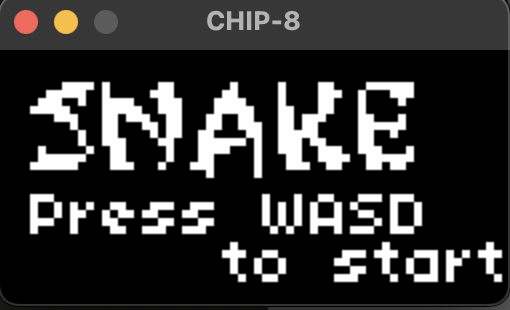
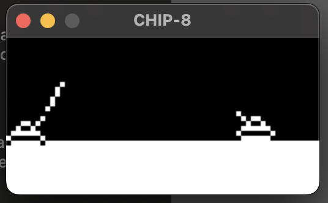
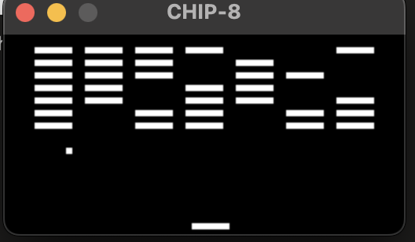

# CHIP8

Chip-8 Interpreter/Emulator written in C17. No sound support. Based on this amazing guide: https://tobiasvl.github.io/blog/write-a-chip-8-emulator/

Tests from https://github.com/Timendus/chip8-test-suite and games from https://johnearnest.github.io/chip8Archive/.

## Building

- Install SDL2 (On Debian `sudo apt-get install libsdl2-2.0-0 && sudo apt-get install libsdl2-dev`)

- `make`

## Usage

Run the emulator with the command `./chip8 <Scale> <Delay (ms)> <ROM Path>`.

## Screenshots 

